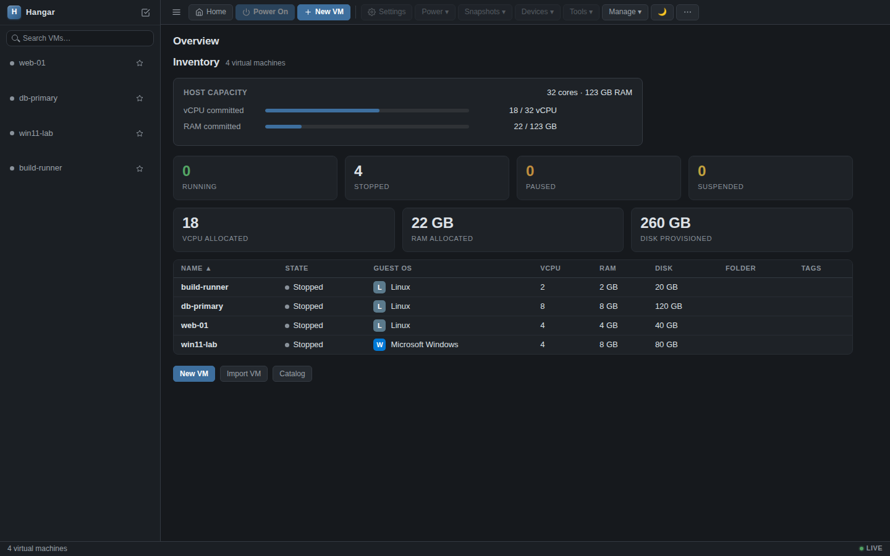

# Hangar

Lightweight QEMU virtual-machine manager with a web UI and an optional native
WebView desktop wrapper. No libvirt. Single Zig daemon serves the HTTP API, the
embedded web UI, and the remote control protocol; `vmrun` is a CLI client.



## Why

Running a handful of QEMU VMs on a workstation usually means one of two things:
hand-written `qemu-system-*` command lines that nobody can remember, or libvirt
with its daemon, XML domain format, and policy layers. Hangar keeps QEMU's
process model and drops everything else: one static binary owns the VM configs
(a single JSON file), spawns QEMU directly, and talks QMP for guest control.
The web UI is embedded in that binary with no build step, so `zig build web`
and a browser is the whole install.

## Features

- Create, clone (full or linked), rename, delete (with undo), import VMs.
- Power on/off, suspend/resume, pause, reset, snapshots (take/revert/delete),
  live CD/ISO change, disk resize/compact, secondary + extra disks, OVF export.
- Browser consoles: VNC (noVNC) and SPICE (spice-html5) with a WebGPU/WebGL2
  presenter, plus a real xterm.js serial terminal, all in the Console tab.
- Optional hardware-accelerated H.264 video streaming of the guest display to
  the browser via WebCodecs (see `docs/VIDEO-PIPELINE.md`).
- Virtual networks (NAT/host-only/bridged) with a visual topology view.
- Host dashboard, sortable inventory, folders, tags, command palette (Ctrl+K),
  multi-select bulk operations, light/dark themes, live updates over SSE.

## Prerequisites

- **Zig 0.16.0** (the build pins backend/linker flags for this version).
- **libvncclient development headers and library**, including `rfb/rfbclient.h`,
  plus **pkg-config** and the platform C development toolchain.
- **Bun 1.4.0** and **ShellCheck** for the CI lint checks. Bun is also used for e2e tests.
- **QEMU** (`qemu-system-x86_64`, `qemu-img`); `cloud-localds` for cloud-init,
  `swtpm` for TPM, OVMF for UEFI, all optional per feature.
- For the encoded-video pipeline: `ffmpeg` (uses `h264_vaapi` when a
  `/dev/dri/renderD*` node is available, else `libx264`).
- For e2e tests: `bun install --frozen-lockfile` and Chromium
  (`bun run e2e:install`). The shell integration tests also need Python 3 and curl.

### Contributor setup (Ubuntu 24.04)

With Zig 0.16.0 and Bun 1.4.0 on `PATH`, install the build/check dependencies
(the VNC package provides both the client headers and library):

```bash
sudo apt-get update
sudo apt-get install --no-install-recommends -y build-essential libvncserver-dev pkg-config shellcheck
```

From the clone's root, run the same build, format, lint, and unit/fuzz gates as CI:

```bash
zig build check
```

These checks do not require `bun install` or Chromium. The first Zig build fetches
its pinned dependencies. Build output goes to `zig-out/bin/`; no global install
is needed. Install QEMU separately before creating or powering on VMs.

## Build / Run / Test

```bash
zig build web          # build + launch the web backend (HTTP on :9080)
zig build webui        # build + launch the native WebView desktop wrapper
zig build test         # all hermetic unit + fuzz tests (no network/browser)
zig build web-e2e      # Playwright web UI e2e (standalone; needs bun + chromium)
zig build test-api     # HTTP API integration test (spawns a real daemon)
zig build test-vmrun   # vmrun CLI integration test (spawns a real daemon)
```

Use `zig build --help` to list build steps. For a shorter edit/test loop, run a
single module (including its imported tests) with the suite's linker flags,
libraries, and module imports:

```bash
zig build test-unit-persist
zig build test-unit-vnc_client
```

Every registered module has a `test-unit-<module>` step. `test-unit-vmrun` runs
the CLI unit tests; `test-vmrun` runs the standalone daemon integration suite.

Tests live at the bottom of each Zig module; register new test modules in
`build.zig`. Before opening a pull request, run `zig build check` to also catch
errors reachable only through the executables. Web workflow changes additionally
need a Playwright test under `tests/e2e/` and a `zig build web-e2e` run.

Open http://127.0.0.1:9080 after `zig build web`. A daemon started without
`KV_API_KEY` binds the IPv4 loopback, so address it as `127.0.0.1`, not
`localhost` (which resolves to `::1` on most distributions).

## Using the CLI

`vmrun` talks to the same daemon over HTTP or a Unix socket. A real session:

```console
$ vmrun http://127.0.0.1:9080 create web-01 4096 4 40
create web-01: ok

$ vmrun http://127.0.0.1:9080 list
[0] web-01  status=stopped  mem=4096MB  cpu=4
[1] db-primary  status=stopped  mem=8192MB  cpu=8

$ vmrun http://127.0.0.1:9080 info web-01
VM [0] web-01
  Status:  stopped
  Guest:   Linux
  Memory:  4096 MB
  CPU:     4 cores
  Disk:    40 GB
  Network: user
```

`vmrun --help` lists all 30 commands (power, snapshots, disks, migration,
import/export). Set `KV_API_KEY` in the environment to reach an exposed daemon.

## Status

Working and covered by tests: the VM lifecycle (create, clone, rename, delete
with undo, import, OVF export), power and guest control over QMP, snapshots,
disk resize/compact, virtual networks, live migration, the browser consoles
(VNC, SPICE, serial), and the `vmrun` CLI. `docs/GAP-ANALYSIS.md` tracks
feature-by-feature parity with VMware Workstation 17.

Partial: the H.264 video pipeline needs a `dbus` display and ffmpeg, and falls
back to `libx264` without a VAAPI render node (`docs/VIDEO-PIPELINE.md`).
Window geometry is still persisted in `Prefs` but no current frontend restores
it, a leftover from the removed FLTK desktop UI.

Not built: TLS termination (front the daemon with a reverse proxy), multi-user
accounts, and any hypervisor backend other than QEMU, though the process
lifecycle already goes through a dispatch table (`src/hv/`).

## Release notes and upgrades

`v0.1.0` is the first and latest tagged release. The changes below are unreleased;
`build.zig.zon` and the private frontend-test `package.json` still declare
`0.1.0`. With only one release tag and no stated compatibility or deprecation
policy, version history does not establish a compatibility guarantee.

### Unreleased

#### Changed: API key validation

`v0.1.0` accepted non-ASCII bytes in `KV_API_KEY`, despite documenting an
ASCII-only value. The daemon now rejects those keys and exits with an error.
The native wrapper also rejects invalid keys before spawning the daemon;
`vmrun` rejects them before connecting, with an error naming `KV_API_KEY`.
Only an unset variable selects the client's built-in default. In `v0.1.0`,
`vmrun` silently substituted that default for empty, overlong, or
whitespace-containing keys; those client configurations now fail with exit code 1.

Before upgrading either the daemon or its clients, replace any non-ASCII key
with a strong, unique secret of 1–64 printable ASCII bytes, excluding spaces
(`!` through `~`). Set the same replacement in the daemon and every client's
`KV_API_KEY` environment, then restart them. The replacement also works with
`v0.1.0`, so rotate it there first if upgrading clients and daemon separately.
Do not unset the key or use `hangar` as a workaround: those values leave the
daemon loopback-only. Existing valid ASCII keys need no change.

#### Changed: effective guest CPU model

In `v0.1.0`, Hyper-V Enlightenments forced QEMU's `host` CPU regardless of the
saved CPU Model. The next QEMU start now uses the selected model with the
Hyper-V properties appended, subject to the fallback below.

With Auto or TCG acceleration, Host and Host Passthrough selections now emit
QEMU's `max` model instead of `host`, whether or not enlightenments are enabled.
The substitution applies to Auto even when KVM is available; it permits TCG
fallback, where `host` cannot start. The saved CPU selection is not rewritten.
Explicit hardware acceleration still preserves Host selections.

To retain the previous `host` launch configuration on a Linux KVM host, set
CPU Model to **Host (default)** and acceleration to **KVM (Linux)** in Settings
and save before the next start. Selecting Host alone with Auto no longer emits
`host`. Explicit KVM requires working KVM access and does not fall back to TCG.
If using software emulation, retain Auto or TCG and validate the guest with the
new effective CPU model. Running QEMU processes are unchanged. Shut down affected
guests before upgrading rather than carrying suspended CPU state across a model
change; use matching CPU and accelerator settings at both live-migration endpoints.

#### Changed: startup and saved configuration validation

- The native wrapper now exits with an error for invalid `KV_PORT` instead of
  probing port 9080. Unset it to use 9080, or set an integer from 1 to 65535.
  The daemon already rejected invalid ports in `v0.1.0`, but now validates its
  port and key before loading configuration or autostarting any guests.
- Integer fields in `vms.json` no longer accept the integer prefix of fractions,
  exponent notation, or malformed numbers. Rejected fields retain their defaults;
  the remaining VM fields still load. Before starting the upgraded daemon, fix
  any hand-written or externally generated values: for example, write
  `"memory_mb":1000`, not `"memory_mb":1e3`, and
  `"disk_bps_throttle":2500`, not `"disk_bps_throttle":2.5e3`.
  Hangar's own integer serialization needs no conversion. Check resource and
  throttle settings before powering on guests, since a default may differ from
  the intended value.

#### Upgrade and rollback precautions

Back up `vms.json` and `networks.json` under `~/.config/hangar/` (or the
`HANGAR_CONFIG_HOME` base) while the daemon is stopped, and keep the previous
binaries. Back up guest disks separately; configuration backups do not contain
guest data. The `vms.json` read limit is now 32 MiB rather than 10 MiB. Before
rolling back to `v0.1.0`, stop guests and the daemon and check the inventory size:
that release cannot load files over 10 MiB. Preserve the newer configuration
before restoring a pre-upgrade backup; restoring it discards later configuration
changes. Review the CPU settings above before restarting guests on either version.

#### Fixed

- Framebuffer polling no longer leaves the framebuffer lock held when no pixels
  are available, preventing subsequent polls and updates from deadlocking.

### v0.1.0 (2026-08-26)

First tagged release: the Zig HTTP daemon, embedded web UI, `vmrun` CLI and
optional native WebView wrapper. Includes VM lifecycle and guest control,
snapshots, disk operations, virtual networks, live migration, browser consoles
and optional H.264 guest video. Requires Zig 0.16.0 and QEMU. The daemon defaults
to loopback-only access; a strong custom API key is required for remote access.

## Configuration

All optional. The daemon validates `KV_API_KEY` and `KV_PORT` before loading VM
state or autostarting guests; the desktop wrapper validates both before spawning
the daemon. `vmrun` validates `KV_API_KEY` before connecting. An empty value is
invalid for either variable.

| Variable | Default | Effect |
| --- | --- | --- |
| `KV_API_KEY` | built-in `hangar` (loopback-only) | X-API-Key secret. **Setting a non-default key also binds all interfaces (`::`).** Unset or `hangar` keeps the daemon loopback-only so the weak default is never reachable off-host. 1–64 printable-ASCII bytes, excluding spaces; invalid values abort startup. In exposed mode, data-bearing API reads require the key. |
| `KV_PORT` | `9080` | TCP listen port (non-zero u16). |
| `HANGAR_CONFIG_HOME` | `$HOME` | Base dir for `~/.config/hangar/*` state. |

Never commit a real `KV_API_KEY`. For any non-local deployment set a strong key
and front the daemon with TLS.

## Layout

- `src/`: Zig daemon, CLI, and web assets (see `src/AGENTS.md` for the module
  map). `src/web/` is the embedded vanilla-JS UI.
- `docs/`: design notes (`DESIGN.md`, `VIDEO-PIPELINE.md`, gap analysis, CUJs).
- `tests/`: standalone integration/e2e suites (the in-module unit/fuzz tests
  live at the bottom of each `.zig`).

State lives in `~/.config/hangar/` (`vms.json`, `networks.json`); only
configuration is persisted, never runtime status.

## Docs

- `docs/DESIGN.md`: architecture, HTTP API, keyboard shortcuts.
- `docs/GAP-ANALYSIS.md`: feature parity against VMware Workstation 17.
- `docs/VIDEO-PIPELINE.md`: the encoded guest-video path.
- `docs/TEST-COVERAGE.md`: what each suite covers and how to run it.
- `AGENTS.md`: build constraints and code conventions.
